# Kubernetes Expense Tracker Monitoring

A production-style DevOps project demonstrating the deployment, scaling, monitoring and alerting of a Java Spring Boot Expense Tracker application on a K3s Kubernetes cluster.

The application is containerized using Docker, deployed on Kubernetes with MySQL as the backend database, and monitored using Prometheus, Grafana, Node Exporter and kube-state-metrics.

Spring Boot Actuator with Micrometer exposes application and JVM metrics which are scraped by Prometheus and visualized through Grafana dashboards.

---

## Project Overview

This project combines two major DevOps areas:

### Phase 1 — Kubernetes Deployment

- Kubernetes cluster using K3s
- Namespace isolation
- ConfigMap
- Kubernetes Secrets
- MySQL Deployment
- PersistentVolumeClaim
- MySQL ClusterIP Service
- Spring Boot Expense Tracker Deployment
- Resource requests and limits
- Liveness Probe
- Readiness Probe
- NodePort Service
- Pod scaling
- Rolling Updates
- Rollbacks
- Horizontal Pod Autoscaler
- Ingress with Traefik

### Phase 2 — Monitoring & Observability

- Prometheus
- Node Exporter
- kube-state-metrics
- Grafana
- Spring Boot Actuator
- Micrometer Prometheus Registry
- Application metrics
- JVM metrics
- CPU monitoring
- Memory monitoring
- Pod monitoring
- Kubernetes node monitoring
- Grafana dashboards
- Grafana Alerting
- Email notification

---

# Architecture

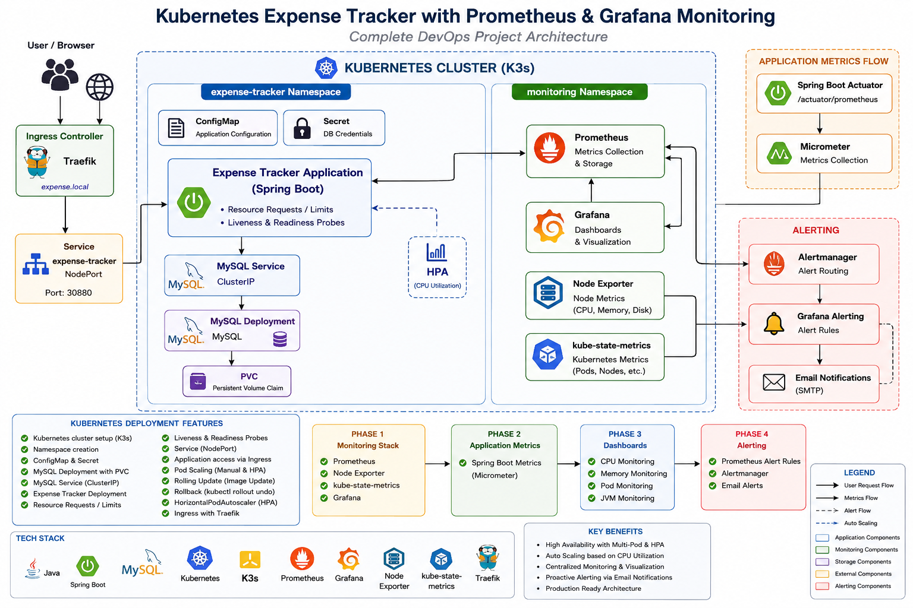

## Architecture Flow

```text
                         USER
                           |
                           v
                    Ingress / NodePort
                           |
                           v
              +-------------------------+
              |  Spring Boot Application|
              |    Expense Tracker      |
              +-------------------------+
                           |
                 +---------+---------+
                 |                   |
                 v                   v
              MySQL              Actuator
                 |                   |
                 v                   v
          Persistent Volume       Micrometer
                                     |
                                     v
                                Prometheus
                                     |
                 +-------------------+-------------------+
                 |                   |                   |
                 v                   v                   v
          Node Exporter      kube-state-metrics    Application
                 |                   |               Metrics
                 +-------------------+-------------------+
                                     |
                                     v
                                  Grafana
                                     |
                                     v
                              Alerting / Email
```

---

# Technology Stack

| Technology | Purpose |
|---|---|
| Linux / RHEL | Development and Kubernetes environment |
| K3s | Lightweight Kubernetes cluster |
| Kubernetes | Container orchestration |
| Docker | Application containerization |
| Java 17 | Application runtime |
| Spring Boot | Backend application |
| Maven | Build and dependency management |
| MySQL | Database |
| ConfigMap | Non-sensitive configuration |
| Secret | Sensitive credentials |
| PersistentVolumeClaim | Persistent database storage |
| NodePort | Application external access |
| Ingress / Traefik | Kubernetes HTTP routing |
| HPA | Automatic pod scaling |
| Prometheus | Metrics collection |
| Grafana | Metrics visualization |
| Node Exporter | Kubernetes node metrics |
| kube-state-metrics | Kubernetes object/state metrics |
| Micrometer | Spring Boot metrics |
| Git / GitHub | Version control |

---

# Kubernetes Implementation

## 1. Kubernetes Cluster

The application is deployed on a K3s Kubernetes cluster.

```bash
kubectl get nodes
```

---

## 2. Namespace

A dedicated namespace is used for the Expense Tracker application.

```bash
kubectl get namespace
```

Namespace:

```text
expense-tracker
```

---

## 3. ConfigMap

Application configuration that is not sensitive is managed using a Kubernetes ConfigMap.

```bash
kubectl get configmap -n expense-tracker
```

---

## 4. Kubernetes Secret

Database credentials are stored using Kubernetes Secrets.

For security, the actual secret file is not committed to GitHub.

A safe example is provided:

```text
k8s/secret-example.yaml
```

Create your own secret file locally with the required credentials before deployment.

---

## 5. MySQL Deployment

MySQL runs inside Kubernetes as a Deployment.

```bash
kubectl get deployment -n expense-tracker
```

---

## 6. Persistent Storage

A PersistentVolumeClaim is used so that MySQL data is not dependent on the lifetime of the MySQL pod.

```bash
kubectl get pvc -n expense-tracker
```

Example:

```text
mysql-pvc
Status: Bound
```

---

## 7. MySQL Service

MySQL is exposed internally using a ClusterIP Service.

```bash
kubectl get svc -n expense-tracker
```

The Spring Boot application communicates with MySQL through the Kubernetes Service.

---

# Spring Boot Application Deployment

The Expense Tracker application is containerized using Docker.

The application image is built using a multi-stage Dockerfile:

```text
Maven Build Stage
       |
       v
Spring Boot JAR
       |
       v
Java 17 Runtime Image
       |
       v
Docker Container
       |
       v
Kubernetes Pod
```

---

# Health Monitoring

Liveness and Readiness probes are configured for the Spring Boot application.

### Liveness Probe

Determines whether the application container is alive.

### Readiness Probe

Determines whether the application is ready to receive traffic.

Spring Boot Actuator endpoints are used for health monitoring.

```text
/actuator/health
```

---

# Pod Scaling

The application supports multiple replicas.

Example:

```bash
kubectl scale deployment expense-tracker \
--replicas=2 \
-n expense-tracker
```

Verify:

```bash
kubectl get pods -n expense-tracker
```

---

# Rolling Update

A new Docker image version can be deployed without stopping the application completely.

Example:

```bash
kubectl set image deployment/expense-tracker \
expense-tracker=<NEW_IMAGE> \
-n expense-tracker
```

Check rollout:

```bash
kubectl rollout status deployment/expense-tracker \
-n expense-tracker
```

---

# Rollback

If a new version causes a problem, the deployment can be rolled back.

```bash
kubectl rollout undo deployment/expense-tracker \
-n expense-tracker
```

Verify:

```bash
kubectl rollout status deployment/expense-tracker \
-n expense-tracker
```

---

# Horizontal Pod Autoscaler

HPA is configured to automatically scale the Expense Tracker deployment based on CPU utilization.

Example:

```bash
kubectl get hpa -n expense-tracker
```

Configured range:

```text
Minimum replicas: 1
Maximum replicas: 5
CPU target: 50%
```

---

# Ingress

Traefik Ingress is configured for HTTP routing to the Expense Tracker application.

The application can be accessed through the configured Kubernetes Ingress / NodePort configuration.

---

# Monitoring Stack

## Prometheus

Prometheus collects metrics from:

- Spring Boot application
- JVM
- Kubernetes pods
- Kubernetes resources
- Kubernetes node

Prometheus target status is verified using the Prometheus Targets page.

---

## Node Exporter

Node Exporter collects infrastructure-level node metrics such as:

- CPU
- Memory
- Filesystem
- Load
- Network
- System statistics

Node Exporter runs as a Kubernetes DaemonSet.

---

## kube-state-metrics

kube-state-metrics exposes Kubernetes object and state information.

It provides metrics related to:

- Pods
- Deployments
- ReplicaSets
- Namespaces
- Nodes
- Resource states
- Kubernetes workloads

---

# Spring Boot Metrics

Spring Boot Actuator and Micrometer are configured to expose Prometheus-compatible metrics.

Endpoint:

```text
/actuator/prometheus
```

Example metrics include:

```text
process_cpu_usage
process_uptime_seconds
jvm_classes_loaded_classes
jvm_memory_used_bytes
http_server_requests_seconds
application_ready_time_seconds
```

Prometheus scrapes these metrics automatically.

---

# Grafana Dashboards

Grafana is connected to Prometheus as a data source.

The monitoring dashboard includes:

### Application Monitoring

- Application availability
- Application uptime
- HTTP request rate
- JVM CPU usage
- JVM memory usage

### Kubernetes Monitoring

- Running pods
- Pod status
- Node CPU usage
- Node memory usage

---

# Alerting

Grafana Alerting is configured for the Expense Tracker application.

Example alert:

```text
Expense Tracker Application Down
```

Prometheus query:

```promql
up{job="expense-tracker"}
```

Alert condition:

```text
up < 1
```

If the application becomes unavailable, the alert changes to a firing state.

Email notification is configured through the Grafana contact point.

---

# Project Structure

```text
kubernetes-monitoring-expense-tracker/
│
├── architecture/
│
├── docs/
│   ├── 01-Architecture-image.png
│   ├── 02-home-page.png
│   ├── 03-login.png
│   ├── 04-expense-added.png
│   ├── 05-Pods-image.png.jpeg
│   ├── 06-deployment.png.jpeg
│   ├── 07-quality-check.png.jpeg
│   ├── 08-kubernetes-deployment-and-monitoring-status.png.jpeg
│   ├── 09-grafana-alerting.png
│   ├── 10-grafana-dashboard.png
│   ├── 11-grafana-dashboard.png
│   └── 12-Prometheus-Targets.png
│
├── k8s/
│   ├── namespace.yaml
│   ├── configmap.yaml
│   ├── secret-example.yaml
│   ├── mysql-deployment.yaml
│   ├── mysql-service.yaml
│   ├── mysql-pvc.yaml
│   ├── expense-deployment.yaml
│   ├── expense-service.yaml
│   └── expense-ingress.yaml
│
├── monitoring/
│   ├── prometheus/
│   │   ├── prometheus-configmap.yaml
│   │   ├── prometheus-deployment.yaml
│   │   ├── prometheus-rbac.yaml
│   │   └── prometheus-service.yaml
│   │
│   ├── grafana/
│   │
│   ├── node-exporter/
│   │
│   └── kube-state-metrics/
│
├── screenshots/
│
├── README.md
└── LICENSE
```

---

# Security

Sensitive credentials are intentionally excluded from the repository.

The following files should never contain real production credentials:

```text
.env
secret.yaml
credentials files
API tokens
password files
```

Use:

```text
k8s/secret-example.yaml
```

as a template for creating Kubernetes Secrets locally.

---

# Monitoring Verification

### Check application pods

```bash
kubectl get pods -n expense-tracker
```

### Check monitoring pods

```bash
kubectl get pods -n monitoring
```

### Check Prometheus targets

Open the Prometheus Targets page and verify that targets are:

```text
UP
```

### Check HPA

```bash
kubectl get hpa -n expense-tracker
```

### Check PVC

```bash
kubectl get pvc -n expense-tracker
```

### Check Grafana

Open Grafana and verify:

- Application CPU
- JVM Memory
- HTTP Requests
- Application Uptime
- Running Pods
- Node CPU
- Node Memory
- Application Availability

---

# Project Screenshots

## 1. Project Architecture


---

## 2. Expense Tracker Home Page

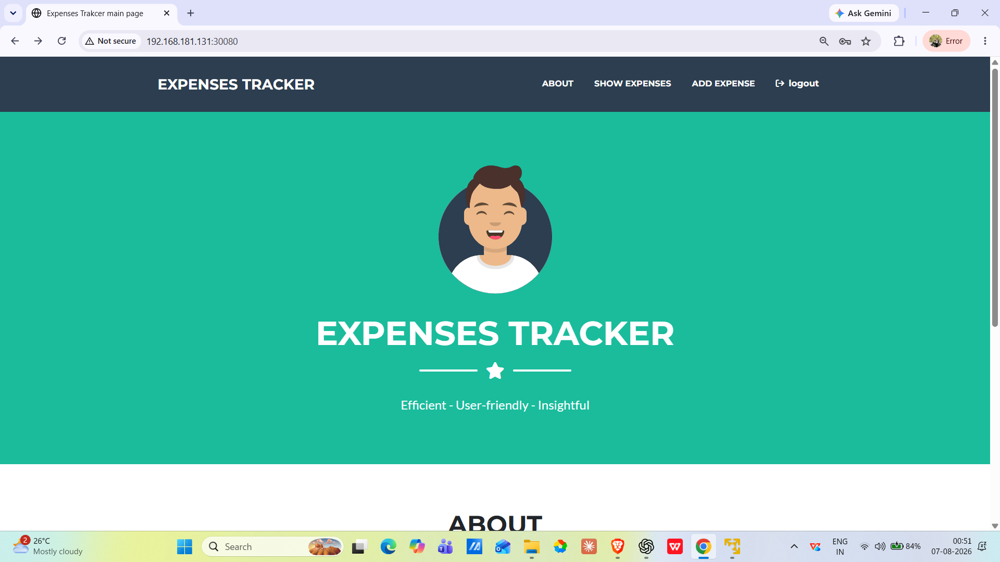

---

## 3. Expense Tracker Login

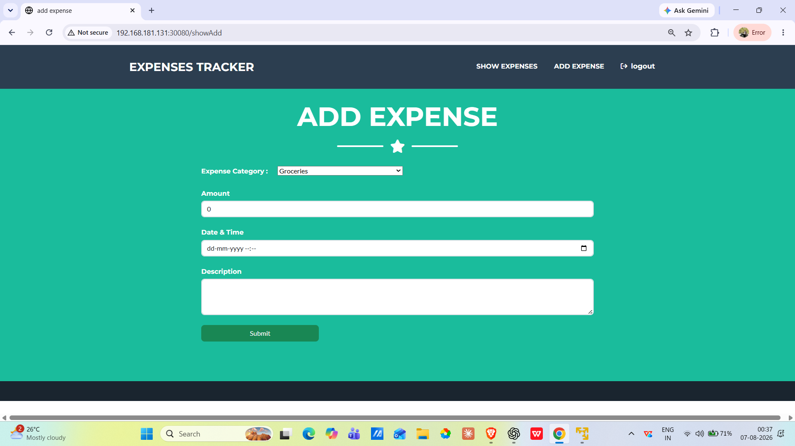

---

## 4. Expense Added Successfully

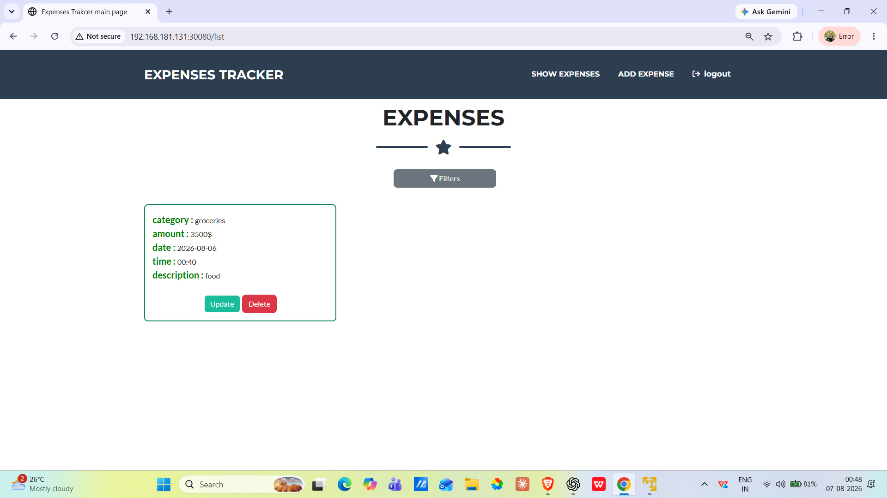

---

## 5. Kubernetes Pods

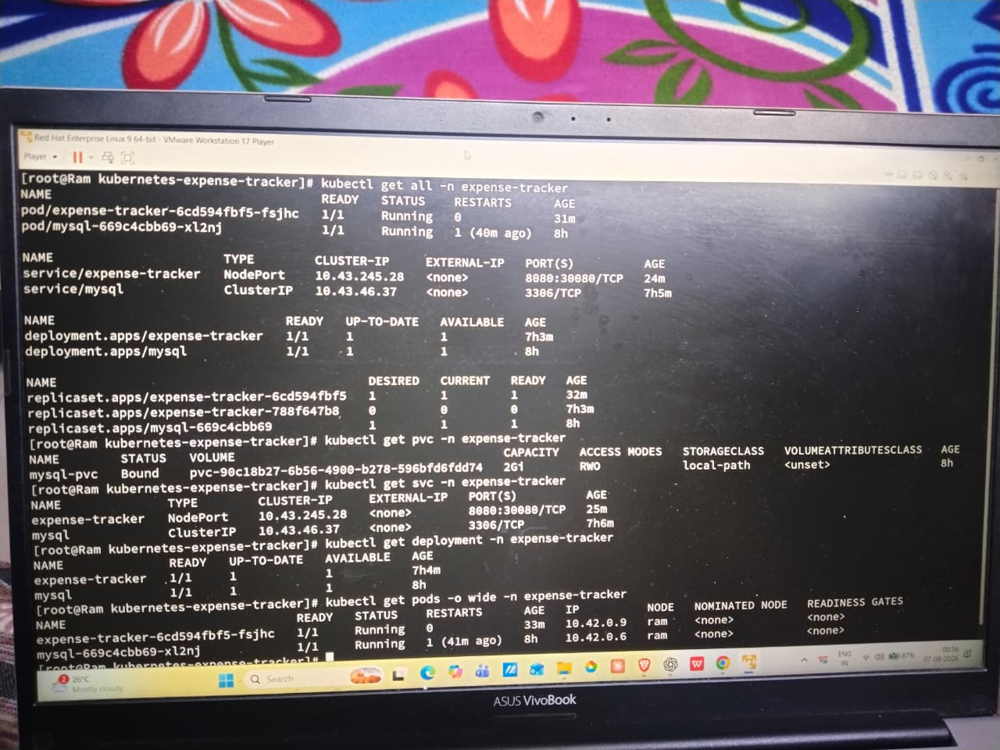

---

## 6. Kubernetes Deployment

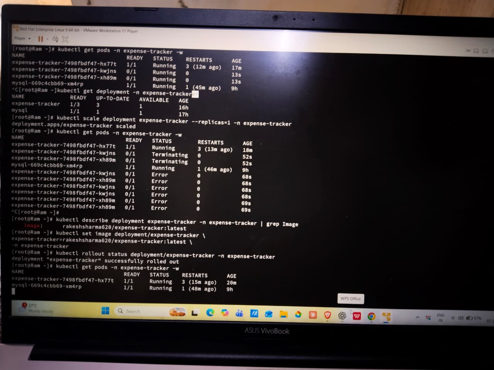

---

## 7. SonarQube Quality Check

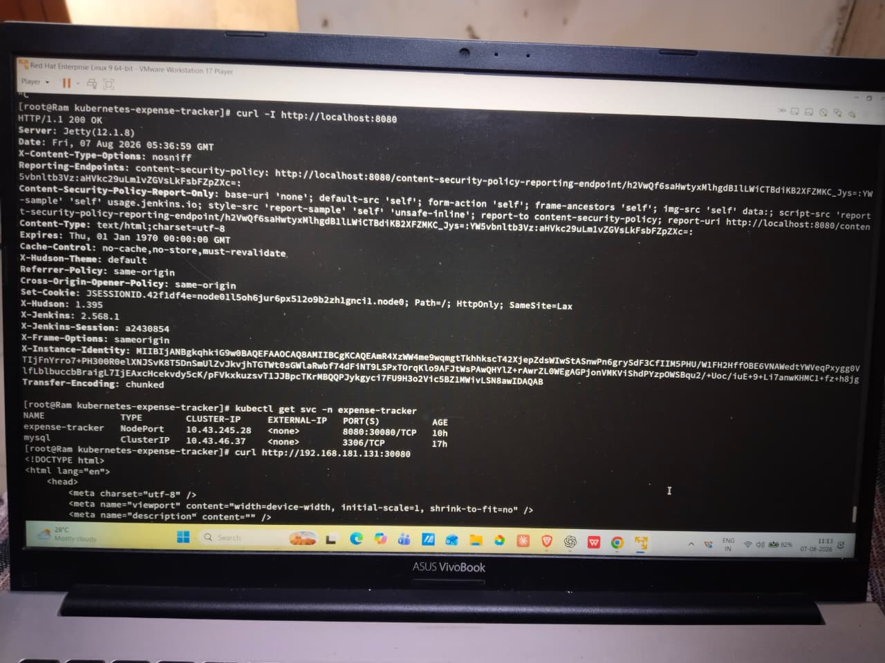

---

## 8. Kubernetes Deployment and Monitoring Status

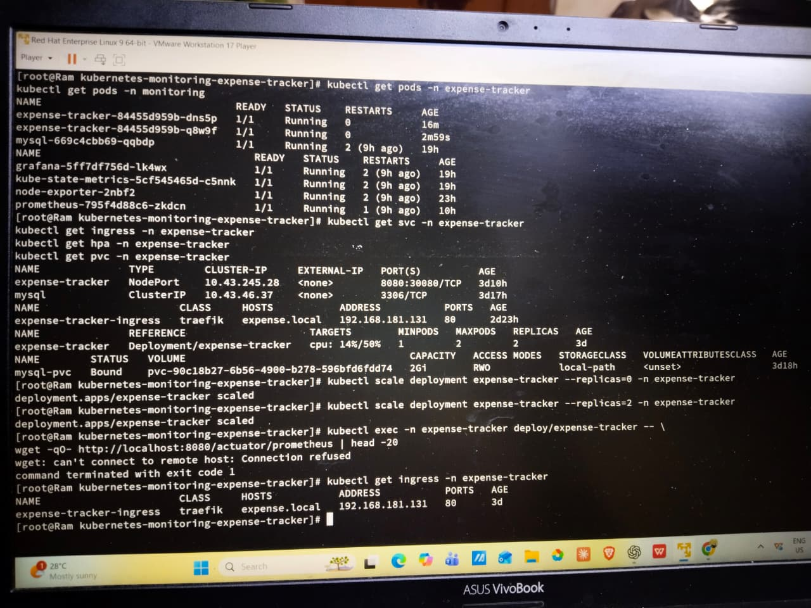

---

## 9. Grafana Alerting

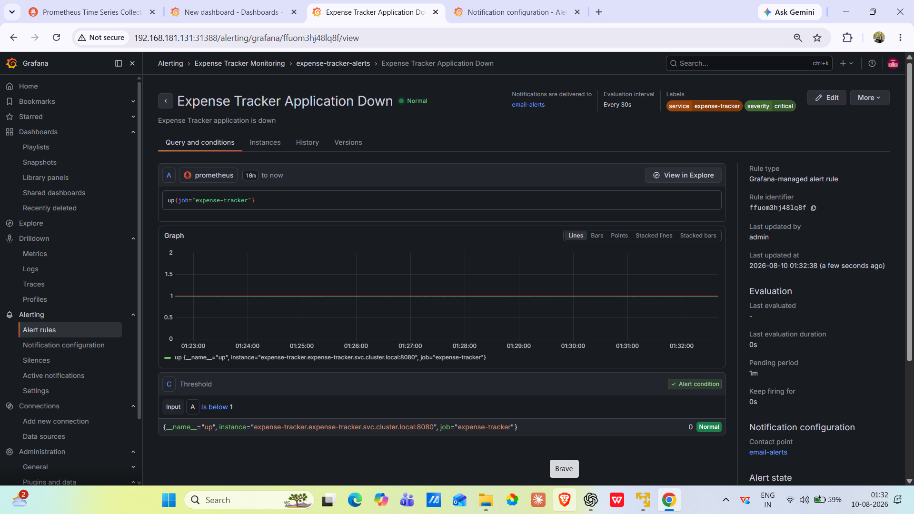

---

## 10. Grafana — Application & JVM Monitoring

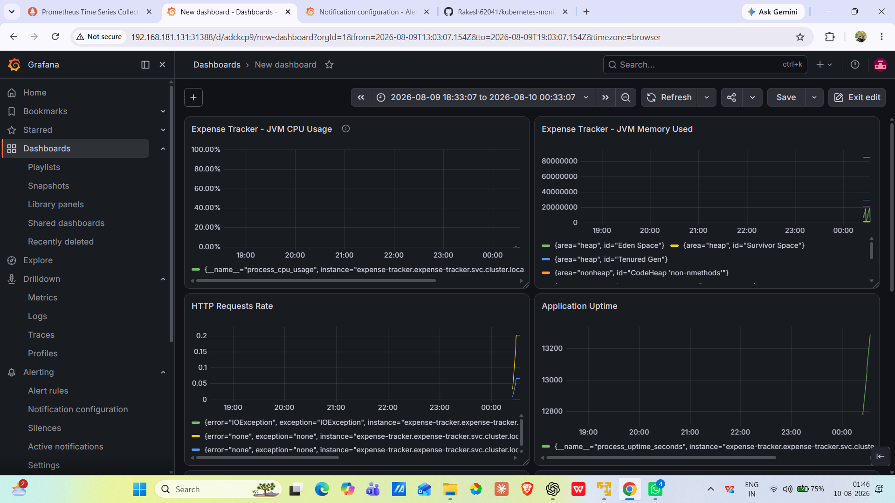

---

## 11. Grafana — Kubernetes Infrastructure Monitoring

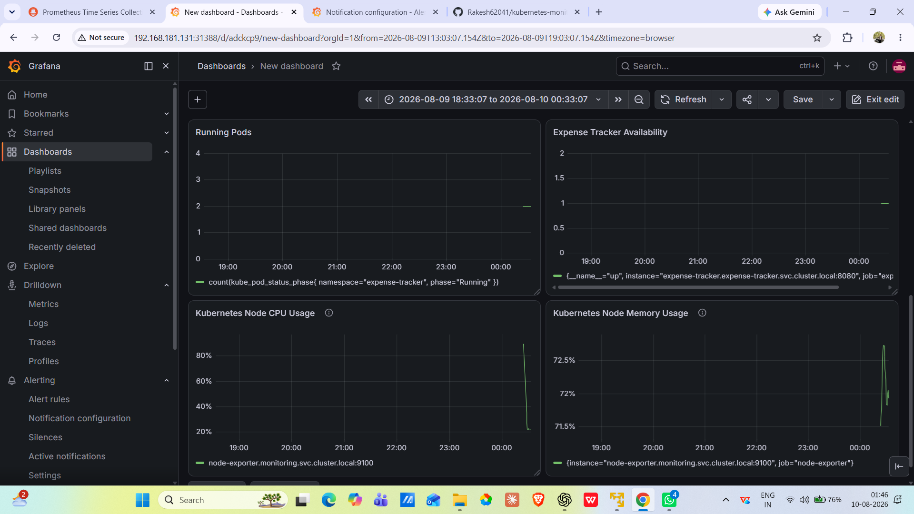

---

## 12. Prometheus Targets

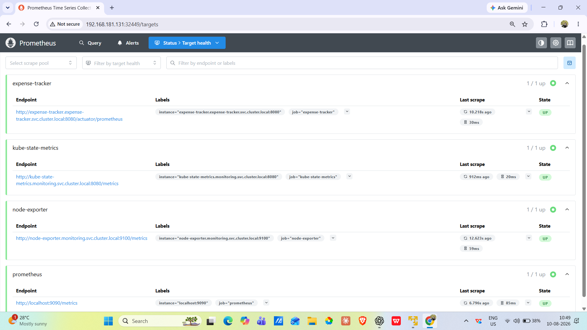

The Prometheus Targets page verifies that the monitoring targets are successfully being scraped and are in the `UP` state.

---

# What's Next

- TLS on Ingress using cert-manager
- Grafana dashboards provisioned as code instead of manual setup
- CI pipeline to auto-build and push the image on every commit
- Alertmanager routing beyond email (Slack, PagerDuty)

---

# Author

**Rakesh Sharma**

DevOps / Cloud Engineer

GitHub:
https://github.com/Rakesh62041
